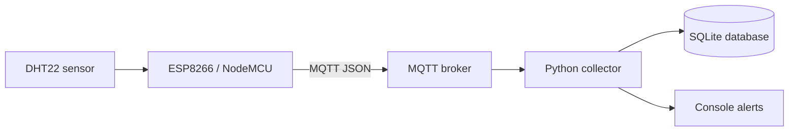

# Smart Room IoT Monitor

A small end-to-end embedded systems project that turns an ESP8266 + DHT22 into a networked environmental monitor. The firmware publishes temperature, humidity, heat index, Wi-Fi signal strength, and uptime over MQTT. A Python collector subscribes to the telemetry stream, validates the payload, stores readings in SQLite, and prints threshold alerts.

## Why this project is useful

This repository demonstrates embedded C/C++, sensor integration, Wi-Fi, MQTT, JSON telemetry, fault-tolerant reconnect logic, Python, SQLite, and automated tests in one compact project.

## Architecture



## Features

- Non-blocking DHT22 sampling every 5 seconds
- Automatic Wi-Fi and MQTT reconnection
- MQTT Last Will and Testament status message
- JSON telemetry with temperature, humidity, heat index, RSSI, and uptime
- Python validation before data is stored
- SQLite persistence
- High-temperature and high-humidity alerts
- Unit tests for payload validation
- GitHub Actions workflow for Python tests
- Secrets kept out of source control through a local `config.h`

## Hardware

- NodeMCU ESP8266
- DHT22 temperature/humidity sensor
- USB cable
- 10 kΩ pull-up resistor recommended between DHT22 DATA and 3.3 V

### Wiring

| DHT22 | NodeMCU |
|---|---|
| VCC | 3.3 V |
| DATA | D4 / GPIO2 |
| GND | GND |

## MQTT payload

Example telemetry message:

```json
{
  "device_id": "room-node-01",
  "temperature_c": 23.70,
  "humidity_pct": 51.20,
  "heat_index_c": 23.54,
  "rssi_dbm": -48,
  "uptime_s": 127
}
```

Default topic: `alex/smart-room/telemetry`

## Firmware setup

1. Open `firmware/smart_room_monitor.ino` in Arduino IDE.
2. Install the ESP8266 board package.
3. Install these Arduino libraries:
   - `PubSubClient`
   - `DHT sensor library` by Adafruit
4. Copy `firmware/config.example.h` to `firmware/config.h`.
5. Enter your Wi-Fi and MQTT settings in `config.h`.
6. Select **NodeMCU 1.0 (ESP-12E Module)** and upload.

## Python collector

Create a virtual environment and install the dependency:

```bash
cd collector
python -m venv .venv
# macOS/Linux
source .venv/bin/activate
# Windows PowerShell
# .venv\\Scripts\\Activate.ps1
pip install -r requirements.txt
```

Run the collector:

```bash
python collector.py --broker test.mosquitto.org --topic alex/smart-room/telemetry
```

Optional thresholds:

```bash
python collector.py --broker test.mosquitto.org \
  --max-temp 28 \
  --max-humidity 70
```

The SQLite database is created automatically as `telemetry.db`.

## Run tests

```bash
cd collector
python -m unittest discover -v
```

## Example console output

```text
[room-node-01] 23.7 C | 51.2 %RH | RSSI -48 dBm
[room-node-01] 29.4 C | 67.1 %RH | RSSI -52 dBm  ALERT: temperature above 28.0 C
```

## Possible extensions

- Grafana dashboard
- Home Assistant discovery
- OLED display on the ESP8266
- Deep-sleep battery mode
- TLS-enabled MQTT
- Multiple sensor nodes with device-specific topics

## License

MIT License. See `LICENSE`.
